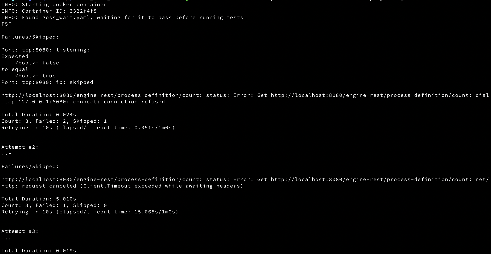
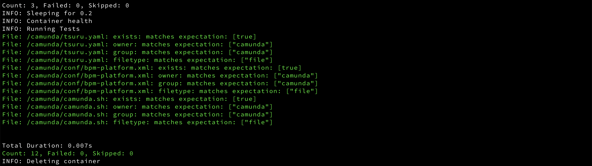

# Exemplos de utilização da ferramenta DGOSS

Nesse repositório você vai encontrar exemplos do uso da ferramenta DGOSS para testes em imagens docker.


Em ambos os exemplos temos o mesmo `Dockerfile`, ou seja, uma aplicação em Node.Js que executa na porta 8080 retornando um `Hello World`

## Example - 1

No exemplo 1 criamos o arquivo `goss.yml`, contando a validação do arquivos `server.js` e suas permissões. Além dessa validação temos a verificação se o processo `NODE` está rodando no container, se a porta `8080` está aberta e se está retornando `200` ao chamar o endereço `http://localhost:8080`.

Para criamos esse arquivo, foi executado o comando: 
```sh
 $ dgoss edit "NOME DA IMAGEM"
```
O que esse comando faz?

Basicamente esse comando ele carrega a ferramenta `goss` para dentro do seu container.

Após executar esse comando você entrar no shell da máquina e lá você poderá executar todos os comandos da ferramneta `goss`.

Agora vamos gerar o arquivo `goss.yaml` com o primeiro teste que é a validação se o arquivo foi copiado para dentro da imagem. 

### Add

Vamos precisar entrar na pasta onde está localizado o arquivo `server.js` e digitar o seguinte comando:
```shell
$ goss add file server.js
```
O comando `add` server para adicionar recursos ao seu teste. Recursos esses que você pode encontrar nesse [link](https://github.com/aelsabbahy/goss/blob/master/docs/manual.md)

#### File

Nesse comando estamos adicionando o recurso `file`, que nele você consegue validar existencia, permissionamento, informações(tamanho, etc), conteúdo.

#### Process
Comando:
```shell
$ goss add process node
```

Nesse comando estamos adicionando o recurso `process`, que nele vamos validar se o processo está rodando. Nesse caso não vamos validar o nome do processo e sim o binário que é encontrado através do comando `ps -p <PID> -o comm`.
```shell
$ ps -p 1 -o comm
COMMAND
node
```

#### Port

Comando:
```shell
$ goss add port 8080
```
Resultado:
```
port:
  tcp:8080:
    listening: true
    ip:
    - 0.0.0.0
```

Nesse comando estamos adicionando o recurso `port`, que vai validar o status da porta local. Ex: `80`, `8080` ou `udp:123`.
Os procotolos que podemos testar são:

* tcp
* tcp6
* udp
* udp6


#### Http

Comando:
```shell
$ goss add http http://localhost:8080
```
Resultado:
```shell
$ goss add http http://localhost:8080

Adding HTTP to './goss.yaml':

http://localhost:8080:
  status: 200
  allow-insecure: false
  no-follow-redirects: false
  timeout: 5000
  body:
    - Hello World
```

Nesse comando estamos adicionando o recurso `http`, que vamos validar o código do response e se o body vai ser `Hello World`. Porém podemos validar outras coisas com esse recurso como header, se contém uma URI, username, password para autenticação e entre outros podendo ser visto nesse [link](https://github.com/aelsabbahy/goss/blob/master/docs/manual.md#http)


### Goss.yaml

No final teremos o arquivo `goss.yaml` com o seguinte conteúdo:
```yaml
file:
  /usr/src/app/server.js:
    exists: true
    mode: "0644"
    size: 257
    owner: root
    group: root
    filetype: file
    contains: []
process:
  node:
    running: true
port:
  tcp:8080:
    listening: true
    ip:
    - 0.0.0.0
http:
  http://localhost:8080/:
    status: 200
    allow-insecure: false
    no-follow-redirects: false
    timeout: 5000
```


## Example - 2

Nesse exemplo vamos utilizar os mesmos testes porém agora vamos separar os testes de `port` e `http`. Vamos colocar no arquivo `goss_wait.yaml`. 

O que seria esse arquivo?

Nesse arquivo você defini quais recursos irão ser testados depois que a aplicação subir. Ou seja, caso você suba uma imagem porém o serviço demore um pouco para subir, esse arquivo com mais alguns parâmetros irão te ajudar na execução dos testes.


Então, vamos criar o arquivo `goss_wait.yml` contendo só esses recursos. E para podermos testar, precisamos passar via variável de ambiente a seguinte variável: `GOSS_WAIT_OPTS`. 

Essa variável `GOSS_WAIT_OPTS` precisa receber 2 valores. O primeiro que é o `--retry-timeout ou -r` e o segundo que é o `--sleep ou -s`. Fazendo teste, a forma que entendi desse recurso, é que no primeiro você define a quantidade de total em `s` que vai ocorrer e no segundo vamos ter o tempo do teste. 

**Exemplo:** ```- 60s -sleep 10s```

O total de retentativa vai ser quando chegar em `60s` porém ele vai fazer no intervalo de `10s`. Ou seja, ele vai retentar 6 vezes, caso passe na segunda retentativa ele termina.

Comando
```shell
$ GOSS_WAIT_OPTS="-r 60s -s 10s" dgoss run -e PORT="8080" -p 8080:8080 example_node_1
```

OU
```shell
$ dgoss run -e GOSS_WAIT_OPTS="-r 60s -s 10s" -e PORT="8080" -p 8080:8080 example_node_1
```

Após executar algum desses comando segue o print do resultado.





**REFERÊNCIAS**

[GOSS](https://github.com/aelsabbahy/goss)

[DGOSS Instalation](https://github.com/aelsabbahy/goss/tree/master/extras/dgoss#installation)

[DGOSS EXample](https://github.com/aelsabbahy/dgoss-examples)

[Goss Docker container](https://github.com/aelsabbahy/goss-docker)

[Tutorial: How to test your docker image in half a second](https://medium.com/@aelsabbahy/tutorial-how-to-test-your-docker-image-in-half-a-second-bbd13e06a4a9)